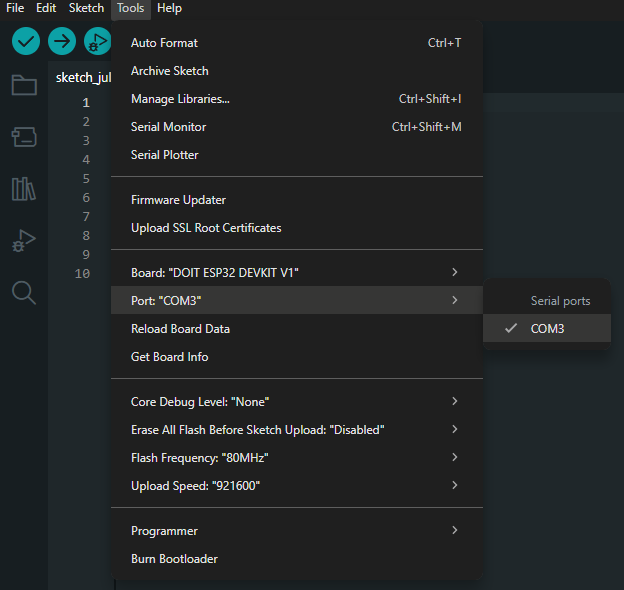
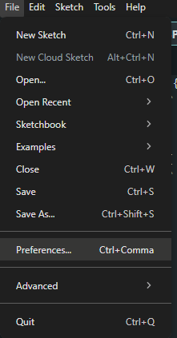
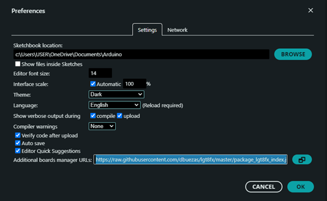
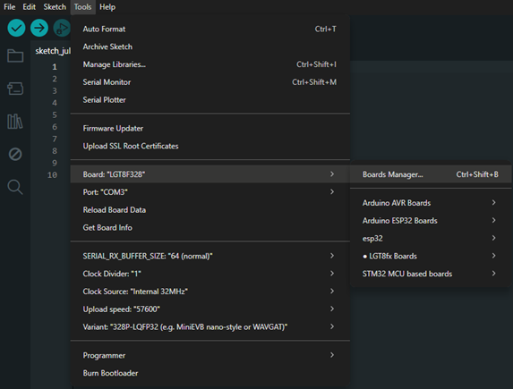
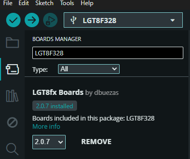
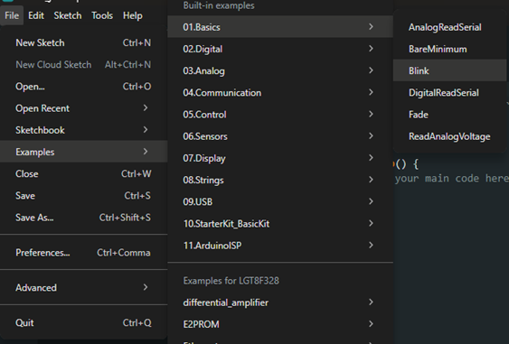
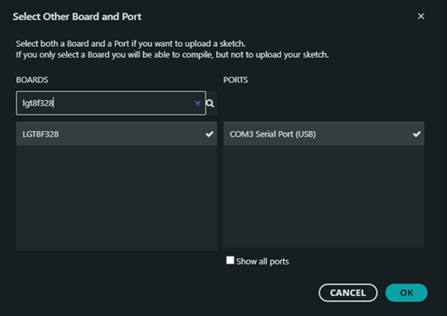
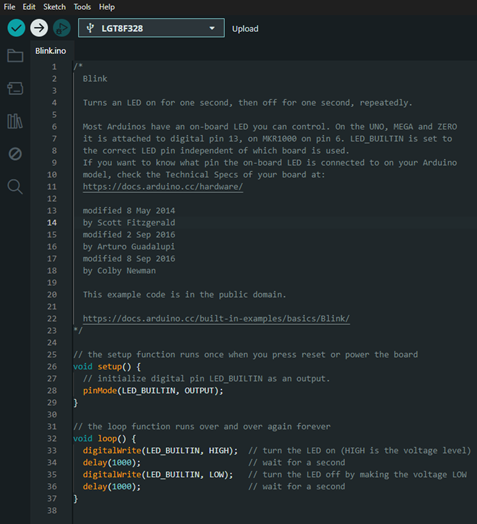
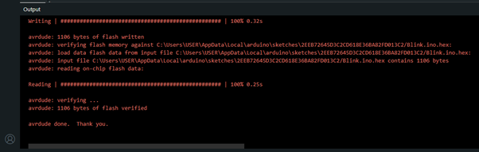
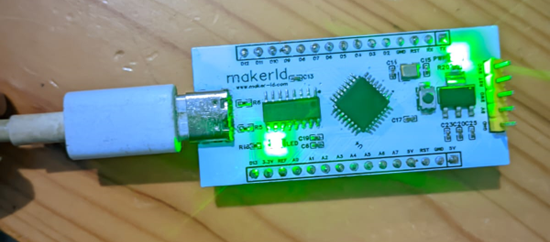

# Setting Up Arduino IDE for LGT8F328P

## 1. Install Driver CH340

1. Download the CH340 Driver:  
   [https://sparks.gogo.co.nz/ch340.html](https://sparks.gogo.co.nz/ch340.html?srsltid=AfmBOoqLAOmrfzoob7wI9eAc2ZUFVEBzvEZ-2m6V1wNqpFqhSOaVu-Jy)

2. Extract the downloaded ZIP file.

3. Run the installer that you extracted.

4. Once CH340 is connected, you will see a COM port in **Tools > Port** in Arduino IDE.  
   The COM number may vary depending on your system.
   

   **Example:**
   `Driver connected on COM3`

---

## 2. Setting Up LGT8F328P Board in Arduino IDE

1. Open **Arduino IDE** (make sure it's installed).

2. Go to: **File > Preferences**

   

3. In the "Additional Board Manager URLs" field, add this URL:
   ```
   https://raw.githubusercontent.com/dbuezas/lgt8fx/master/package_lgt8fx_index.json
   ```
   
4. Click **OK**.

   For more info about this board manager, visit:  
   [https://github.com/dbuezas/lgt8fx](https://github.com/dbuezas/lgt8fx)

---

## 3. Install the Board via Boards Manager

1. Go to menu: **Tools > Board > Boards Manager**

   

2. Search for `LGT8F328`

   

3. Click **Install**

---

## 4. Upload the Blink Sketch

1. Go to:  **File > Examples > 01.Basics > Blink**
   

2. Then select the Select other Board and Port menu, if the installation is correct, the board and port will be read or appear as in the image below :   
   **Select other board and port**

   

   If the installation is successful, the board and port will appear.

3. Click **OK**, then click **Upload** (right arrow icon)

   

4. Wait for the compile and upload process to complete.

   

---

## 5. Result

If the onboard LED blinks, the board is working correctly ✅

   

---

## Author

**Name:** Hafidh Najib  
**Email:** hafidhnajib.2022@student.uny.ac.id
